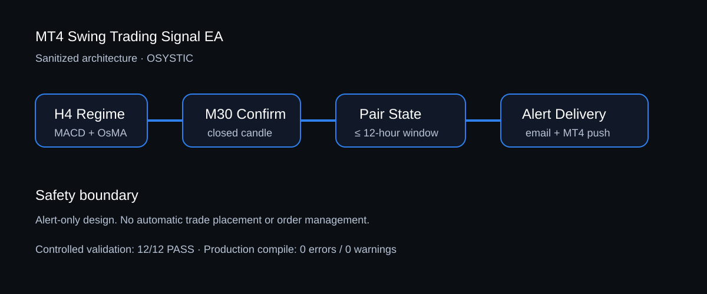

# MT4 Swing Trading Signal EA — Engineering Case Study

> **OSYSTIC ENGINEERING CASE STUDY · PUBLIC SHOWCASE · SANITIZED · PORTFOLIO-SAFE**
>
> This repository contains **no client identity, no confidential MQL4 source, no account credentials, no private conversations, no commercial terms, and no private delivery evidence**.



## Company showcase classification

| Attribute | Public classification |
|---|---|
| Publisher | **OSYSTIC** |
| Artifact type | Engineering case study / capability proof |
| Platform | MetaTrader 4 / MQL4 |
| Domain | Rule-based forex signal automation |
| Operating mode | Alert-only |
| Project status | **Closed** |
| Confidential implementation | Excluded and retained privately |
| Profitability claim | None |

## What this repository is

An anonymized case study of an MT4 Expert Advisor engineered to convert multi-timeframe MACD/OsMA rules and cross-symbol confirmation logic into deterministic, closed-candle alerts.

The engagement focused on translating conversational trading rules into explicit machine-testable conditions, preventing duplicate notifications, handling asynchronous pair confirmation within a fixed time window, and validating alert delivery without placing trades.

## Engineering challenge

- Translate discretionary multi-timeframe indicator rules into deterministic logic.
- Preserve H4 regime constraints while waiting for an M30 confirmation event.
- Confirm two symbols in the same direction even when their zero-line events occur at different times.
- Enforce a strict maximum 12-hour confirmation window.
- Suppress duplicate delivery without blocking genuine later sequences.
- Keep the EA alert-only and separate notification behavior from trade execution.
- Validate rare signal logic without waiting weeks for naturally occurring live conditions.

## Architecture

```text
MT4 market data
      ↓
H4 regime qualification
  ├─ MACD side of zero
  └─ OsMA side of zero
      ↓
M30 closed-candle confirmation
      ↓
Pair-group state machines
  ├─ EURCAD + EURUSD
  └─ EURUSD + GBPUSD
      ↓
12-hour confirmation gate
      ↓
Duplicate / new-sequence control
      ↓
Alert delivery
  ├─ MetaTrader mobile push
  └─ MetaTrader email
```

## Validation outcome

The delivered Phase 1 baseline was compiled successfully with **0 errors and 0 warnings** and completed a controlled **12/12 logic validation with 0 failures**.

The controlled scenarios covered representative BUY/SELL confirmation, invalidation, pair-leading order, exact-window acceptance, expired-window rejection, wrong-direction rejection, duplicate suppression, and legitimate new-sequence re-alert behavior.

A separate test-only harness was used for deterministic evidence generation. It was intentionally isolated from the production EA.

## Technology

`MetaTrader 4` · `MQL4` · `MACD` · `OsMA` · `multi-timeframe state machines` · `cross-symbol confirmation` · `closed-candle logic` · `SendMail` · `SendNotification`

## What is intentionally not claimed

This showcase does **not** claim:

- profitability, alpha, ROI, win rate, or loss prevention;
- that historical or controlled validation predicts trading performance;
- live/funded-account execution because the system was alert-only;
- identical broker behavior across all symbol naming conventions or terminal builds;
- publication of the confidential production MQL4 implementation;
- completion of a later client-environment deployment stage that was outside the preserved closed baseline.

## Read more

- [Full case study](case-study.md)
- [Technical overview](docs/technical-overview.md)
- [Validation methodology](docs/validation-methodology.md)
- [Disclosure boundary](docs/disclosure-boundary.md)
- [Project closure](docs/project-closure.md)

## Public/private boundary

This repository is an independently sanitized public artifact. The production source, settings, raw screenshots, client communications, commercial information, and internal evidence remain private.
